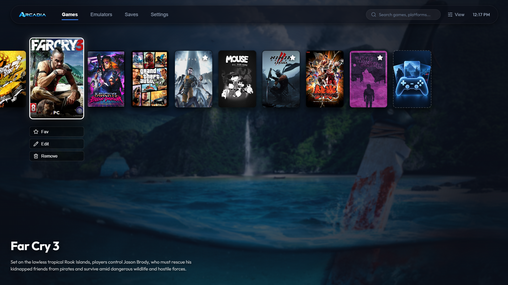
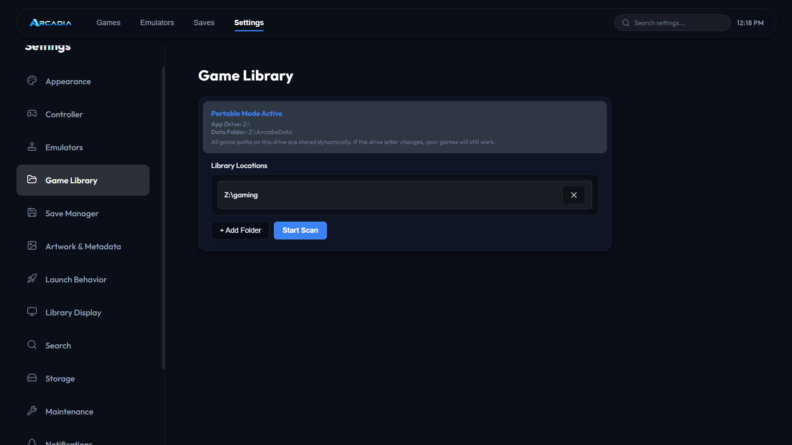

# Arcadia

Arcadia is a sleek, PS5-inspired game library and emulator frontend built for Windows. It provides a full-screen, controller-friendly interface for managing and launching PC games and emulated retro games from a single, beautiful dashboard.

---

## Screenshots

### Home



### Game Library


### Manage Emulators


### Game Editor & Metadata


### Settings



---

## Features

- **Console-Like Experience:** Full 2D grid navigation designed exclusively for gamepad and keyboard control.
- **Unified Multi-Emulator Launcher:** Launch games across multiple emulators and platforms directly from a single, cohesive interface—clicking on any game automatically launches it through its respective emulator.
- **Portable Architecture:** Arcadia is designed to live entirely on an external HDD. Game paths, emulator paths, and databases are stored dynamically (`{DRIVE}\...`), so everything continues to work perfectly even if you plug your HDD into a new PC and the drive letter changes.
- **Strict Library Scanning:** Arcadia aggressively filters PC directories during scans to prevent loose `.exe` and `.bin` data files from polluting your library.
- **Live Appearance Customization:** Seamlessly change the UI scale and accent colors (Blue, Purple, Red) via dynamic CSS variables without restarting the application.
- **Global Modals & Overlays:** Editor and configuration screens render on top of the main UI using React Portals, ensuring focus trapping and seamless controller navigation.

## Architecture & Tech Stack

- **Frontend:** React 19, Vite
- **Backend:** Electron 44 (Node.js)
- **Database:** `sql.js` (SQLite compiled to WebAssembly)
- **Packaging:** `electron-builder`

## Project Structure

```
├── electron/
│   ├── main/          # Core backend services (launcher, scanner, database)
│   └── preload/       # IPC bridge between Node and React
├── renderer/          # React frontend (UI components, pages, theme)
├── assets/            # App icons and default graphics
├── pic/               # Application preview screenshots
├── package.json       # Project dependencies and build scripts
└── vite.config.mjs    # Vite bundling configuration
```

## Setup & Development

1. **Install dependencies:**

   ```bash
   npm install
   ```

2. **Run in development mode:**

   ```bash
   npm run app
   ```

   _This starts the Vite dev server and launches Electron._

3. **Build and Package:**
   ```bash
   npm run package
   ```
   _This compiles the React app into `dist/` and runs `electron-builder` to create a standalone, portable `Arcadia.exe` in the `release/` directory._

## How Portable Mode Works

Arcadia is completely portable out-of-the-box. When you compile it using `npm run package`, the resulting `Arcadia.exe` does not require installation.

When launched, it automatically:

1. Detects the drive letter it is currently running from (e.g. `Z:\`).
2. Creates or connects to the `ArcadiaData\arcadia.db` file on the root of that same drive.
3. Automatically sets your default scan path to `<drive>:\gaming`.
4. Saves all game/emulator paths internally using a `{DRIVE}` token so they instantly resolve correctly on any new PC.
